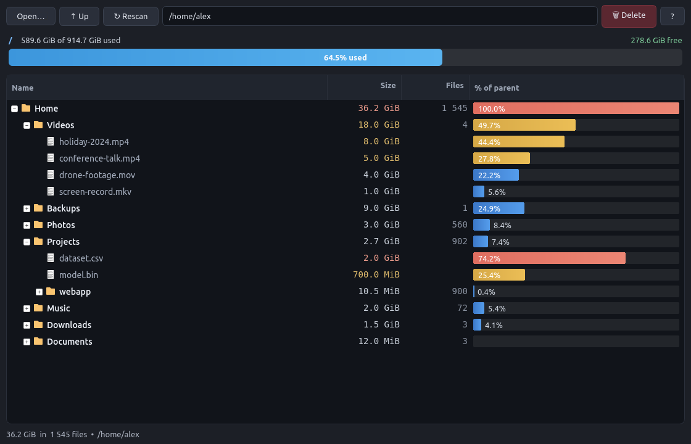

# DiskScope

[](https://github.com/nik-007/disk-scope/actions/workflows/lint.yml)
[](LICENSE)


**A fast, single-window directory-size analyzer for Linux** — find what's
eating your disk and remove it safely. Think `ncdu` / `baobab` with the
single-pane feel of Midnight Commander, focused on one job and built to scale to
**tens of millions of files**.



DiskScope scans a folder and shows every subfolder and file with its
**human-readable size** and **recursive file count**, drawing a bar for each
entry's **share of its parent** so the space hogs jump out at a glance. Results
are cached in memory (re-opening or going *Up* is instant), the partition's
usage is shown along the top, and you can **delete** files or folders right
there — with a single confirmation, after which every parent total and the disk
bar update instantly, no re-scan.

> Single Python file, no build step, no dependencies beyond PyQt5.

## Features

- **Single window, tree view** — click a directory to expand it and see every
  subdirectory and file inside, sorted largest-first by default.
- **Human-readable size + file count** next to every entry. The file count is
  the recursive number of files contained in that directory.
- **Share-of-parent bar** — a colour-graded bar (blue → amber → coral) shows
  how much of the parent each entry takes, so the space hog is obvious at a
  glance, and the biggest sizes are tinted to stand out.
- **In-memory cache** — once a tree is scanned it stays in memory. Re-opening a
  folder or navigating *Up* is instant. The cache is only invalidated for a
  subtree when **you delete something inside it through this tool** (or hit
  *Rescan*).
- **Partition usage bar** at the top shows total / used / free of the disk that
  holds the current folder, with a percentage and color warning as it fills.
- **Safe, efficient deletion** — select one or more items, press `Delete`,
  confirm once, and they're gone. Sizes and counts of all parent rows and the
  disk bar update instantly, with no re-scan.

## Install & run

Requires **Python 3** and **PyQt5**.

```bash
git clone https://github.com/nik-007/disk-scope.git && cd disk-scope
pip install PyQt5            # or: sudo apt install python3-pyqt5

./diskscope                  # scan your home directory
./diskscope /var/log         # …or a specific path
```

Add it to your desktop application menu (optional):

```bash
./install.sh                 # creates ~/.local/share/applications/diskscope.desktop
```

## Keyboard shortcuts

| Key         | Action                          |
|-------------|---------------------------------|
| `Ctrl+O`    | Open / choose a directory       |
| `Backspace` | Go up to the parent directory   |
| `F5`        | Rescan current folder from disk |
| `Delete`    | Delete selected item(s)         |
| `F1`        | About / help                    |
| `Enter` / click arrow | Expand / collapse a folder |

You can also type a path into the address bar and press `Enter`.

## Notes

- Symlinks are **not** followed (no loops); a symlink is counted as a single
  file at its own small size.
- Sizes are apparent file sizes (`st_size`), summed recursively — the same
  basis as most file managers.
- Deletion is **permanent** (`shutil.rmtree` / `os.remove`), not a move to
  trash. You are asked to confirm, with the total size shown, before anything
  is removed. The analyzed root folder itself can never be deleted.

## Performance

Built to scale to tens of millions of files. Three design choices do the work
(measured on a 32 GB Linux box, Python 3.10, PyQt5 5.15):

- **Directories only in memory (~ files don't cost RAM).** Individual files are
  never turned into objects — only directories are kept, with aggregate
  recursive size/count, and files are listed on demand (one `scandir`) when a
  directory is expanded. Memory is therefore proportional to the number of
  **directories**, not files. Measured: 100k files in 6 directories → 6 nodes,
  **0** file objects retained, +1 MB RSS (the old one-node-per-file model would
  use ~25 MB for the same files). `/usr` (852k files) is held in just its
  **68k directory nodes**. A tree with 1M directories needs only a few hundred
  MB regardless of whether it holds 20M or 200M files — the old per-file model
  hit a wall around 20M files (~5 GB).

- **Cyclic GC disabled during a scan.** Directory nodes hold `parent` and
  `subdirs`, forming reference cycles, so only Python's cyclic collector can
  free them — and while scanning we keep everything on purpose. Those periodic
  collections are pure overhead whose cost grows with the live-object count;
  this is what made large scans progressively *stutter and slow down* past a few
  million entries. Disabling GC for the scan gives a **~2.3× speedup at 10M**
  and a steady rate. GC is re-enabled the moment the scan finishes.

- **Optional parallel scanning (opt-in).** A pool of threads can walk
  directories concurrently. This **only helps when `stat()` blocks on I/O** — a
  cold cache, a slow disk, or network storage — because those syscalls release
  the GIL and overlap. On a *warm* cache the work is CPU-bound and the GIL makes
  extra threads a net loss (measured ~2× slower at 8 threads on warm `/usr`), so
  the default is **1 thread**. If the *first* scan of a very large tree on fast
  SSD/NVMe or network storage is slow, opt in:

  ```bash
  DISKSCOPE_THREADS=8 ./diskscope /big/tree
  ```

End-to-end throughput is **150k–350k files/s** on a warm cache (one `stat()`
per file is unavoidable to read sizes). On a cold cache the wall-clock time is
dominated by the disk — exactly like `du`/`ncdu`.

### Benchmark logging

Set `DISKSCOPE_BENCH=1` to append a throughput/memory log to
`/tmp/diskscope_bench.log` (or `DISKSCOPE_BENCH=/path/to/log`). Each scan
records elapsed time, files scanned, instantaneous and average rate, RSS, and
flags any directory with a very large direct-child fan-out:

```bash
DISKSCOPE_BENCH=1 ./diskscope /big/tree
tail -f /tmp/diskscope_bench.log
```

A falling *avg* rate with a flat file count means I/O (cold cache); a falling
rate with steady I/O would point at a structural hot-spot (look for the
`big-dir fan-out` lines).

## Known limitations

- **Apparent size, not blocks.** The tree sums `st_size`, while the disk bar at
  the top reports real allocated blocks from the filesystem. For sparse files
  or filesystems with compression the two figures can legitimately differ.
- **Hard links** are counted once per link, so a file with N hard links
  contributes its size N times to the tree total (the disk only stores it
  once). This matches `du` without `-l` only when links don't span the scanned
  tree.
- **The cache trusts itself.** Results stay in memory until you delete through
  the tool or press **Rescan** (`F5`). If files change *outside* DiskScope, the
  shown sizes can be out of date until you rescan.

## Contributing

Issues and pull requests are welcome — see [CONTRIBUTING.md](CONTRIBUTING.md).
DiskScope aims to stay a small, single-file, PyQt5-only tool, so changes that
keep it focused and fast are the easiest to merge.

## License

MIT — see [LICENSE](LICENSE).
